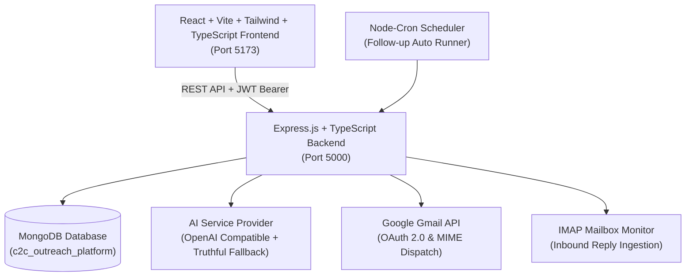

# AI-Powered C2C Job Search & Candidate Outreach Platform

> A production-grade SaaS web application built for USA-focused Corp-to-Corp (C2C) IT recruitment outreach, candidate alignment, and automated follow-up operations.

---

## Architecture Overview



---

## Key Features

1. **USA & C2C Opportunity Discovery**
   - Automated detection of USA locations (`isUSALocation`) across all 50 states, postal abbreviations, and remote variants.
   - Comprehensive C2C detection engine (`detectC2C`) identifying Corp-to-Corp, 1099, and Independent Contractor clauses while rejecting W2-only positions.
   - Manual job creation, human-in-the-loop LinkedIn lead recording, and CSV bulk importing.

2. **Candidate Profile & Resume Management**
   - Master profile editor for verified skills, experience, portfolio, and C2C preferred terms.
   - Master resume file uploads supporting PDF and DOCX parsing (`pdf-parse`, `mammoth`).
   - Automated technical skill extraction and version history tracking.

3. **AI Resume Matcher & Strict Non-Hallucination Tailoring**
   - Calculates target alignment scores, lists matched skills, and flags missing keywords.
   - **Strict Non-Hallucination Policy**: AI never fabricates employers, degrees, skills, or dates.
   - Generates truthful customized resumes with side-by-side comparison, preview, and download.

4. **AI Personalized Outreach Email Generator**
   - Generates professional, human-sounding, C2C-focused introduction emails based on verified candidate credentials.
   - Editable draft, live duplicate check verification, and one-click sending.

5. **Mandatory Duplicate Prevention Engine**
   - Normalizes email addresses (lowercase, trimmed).
   - Scans previous outreach history and blocks duplicate submissions to the same recruiter for the same job.
   - Enforces a 48-hour cooldown protection window and records blocked attempts in `DuplicateLog` audit tables.

6. **Gmail OAuth 2.0 & Dispatch Engine**
   - Direct integration with Google Gmail API via OAuth 2.0 (never stores plain-text passwords).
   - Multi-part MIME email builder with resume attachment support.
   - Seamless development simulation fallback for testing offline.

7. **Automated Follow-up Rule Engine**
   - Automatic 2-touch scheduling (Touch #1 = +3 days, Touch #2 = +7 days).
   - **Guaranteed Auto-Stop Rules**:
     - Automatically cancels pending follow-ups upon receiving recruiter replies.
     - Immediately cancels touches if recruiter is marked `NOT_INTERESTED` or opts out.
     - Automatically stops when max follow-up count (2) is reached.
   - Background scheduler runner powered by `node-cron`.

8. **IMAP Reply Detection & AI Sentiment Classification**
   - Polls inbox for incoming recruiter emails without creating duplicate reply records.
   - Classifies inbound intent into: `INTERESTED`, `INTERVIEW`, `REQUEST_FOR_INFORMATION`, `NOT_INTERESTED`, `OUT_OF_OFFICE`, or `UNKNOWN`.
   - Built-in simulator modal allowing immediate end-to-end testing of reply intake.

9. **CSV Manager (Import & Export)**
   - Uploads CSV files, normalizes emails, validates required fields, flags duplicates in advance, and provides an interactive row-by-row preview table before committing to database.
   - One-click export of filtered Recruiters or Jobs to CSV format.

10. **Real-Time Analytics & SaaS Activity Audit**
    - High-density SaaS dashboard with Recharts visualizations:
      - Daily outreach vs inbound response volume
      - Campaign pipeline progression funnel
      - Top requested tech skills in USA C2C postings
      - Inbound reply intent breakdown
    - Real-time audit log tracking every major platform action.

---

## Tech Stack

### Frontend
- **Framework**: React 18 + Vite + TypeScript
- **Styling**: Tailwind CSS, PostCSS, Lucide React icons
- **State & Routing**: React Router v6, Axios with JWT interceptors, Context API
- **Charts**: Recharts

### Backend
- **Runtime**: Node.js v24 + Express.js + TypeScript (`tsc` / `tsx`)
- **Database**: MongoDB via Mongoose ORM with compound indexes
- **Security**: Helmet, CORS, Express-Rate-Limit, bcryptjs, JSON Web Tokens (JWT)
- **Document Processing**: `pdf-parse`, `mammoth` (DOCX), `multer`
- **Email & Automation**: `googleapis` (Gmail OAuth 2.0), `nodemailer`, `imap-simple`, `mailparser`, `node-cron`
- **CSV**: `csv-parser`, `json2csv`

---

## Project Structure

```
d:/Internship Assignment (JP)/
├── backend/
│   ├── src/
│   │   ├── config/          # MongoDB connection
│   │   ├── controllers/     # REST controllers (auth, jobs, ai, outreach, etc.)
│   │   ├── middleware/      # JWT auth, centralized error handler, multer upload
│   │   ├── models/          # Mongoose models with compound indexes
│   │   ├── routes/          # Express API route definitions
│   │   ├── services/        # Domain business logic (USA filter, C2C filter, AI, Gmail, IMAP)
│   │   ├── jobs/            # Node-cron background runner
│   │   ├── utils/           # Database seed script
│   │   ├── types/           # TypeScript interfaces and declarations
│   │   └── server.ts        # Express server entrypoint
│   ├── uploads/             # Disk storage for resumes and CSV files
│   ├── .env.example         # Environment template
│   ├── package.json
│   └── tsconfig.json
├── frontend/
│   ├── src/
│   │   ├── components/      # UI components
│   │   ├── context/         # AuthContext with auto-login check
│   │   ├── layouts/         # SaaS DashboardLayout with navy sidebar and topbar
│   │   ├── pages/           # Dashboard, Jobs, Recruiters, AI Matcher, Outreach, etc.
│   │   ├── services/        # Axios API client
│   │   ├── types/           # Frontend TypeScript types
│   │   ├── App.tsx          # Router and ProtectedRoute configuration
│   │   └── main.tsx
│   ├── package.json
│   ├── tailwind.config.js
│   └── vite.config.ts
└── README.md
```

---

## Environment Variables

Create `.env` inside `backend/` based on `backend/.env.example`:

```env
# Server
PORT=5000
NODE_ENV=development
CLIENT_URL=http://localhost:5173

# Database
MONGODB_URI=mongodb://127.0.0.1:27017/c2c_outreach_platform

# Security
JWT_SECRET=super_secure_c2c_outreach_jwt_secret_key_2026

# AI Provider (OpenAI Compatible)
AI_PROVIDER=openai
AI_BASE_URL=https://api.openai.com/v1
AI_API_KEY=
AI_MODEL=gpt-4o-mini

# Gmail OAuth 2.0
GOOGLE_CLIENT_ID=
GOOGLE_CLIENT_SECRET=
GOOGLE_REDIRECT_URI=http://localhost:5000/api/settings/gmail/callback

# IMAP Inbound Mail Listener
IMAP_HOST=imap.gmail.com
IMAP_PORT=993
IMAP_TLS=true
IMAP_USER=
IMAP_PASSWORD=

# Optional SMTP Fallback
SMTP_HOST=smtp.gmail.com
SMTP_PORT=587
SMTP_USER=
SMTP_PASS=
```

---

## Quick Start & Local Execution

### 1. Prerequisites
- **Node.js**: v18+ (tested on Node v24)
- **MongoDB**: Local MongoDB instance (`mongodb://127.0.0.1:27017`) or MongoDB Atlas URI

### 2. Seed Database with Realistic Data
Populates 1 Admin user, 5 USA C2C jobs, 8 staffing recruiters, 1 candidate with master resume, 2 campaigns, outreach logs, replies, and follow-ups:
```bash
cd backend
npm run seed
```

**Demo Credentials**:
- Email: `admin@c2coutreach.com`
- Password: `Password123!`

### 3. Run Backend Server
```bash
cd backend
npm run dev
# Server runs on http://localhost:5000
```

### 4. Run Frontend Development Server
```bash
cd frontend
npm run dev
# Frontend runs on http://localhost:5173
```

---

## Automated Test Suite

Execute comprehensive unit and integration tests covering:
- USA location detection rules (50 states + abbreviations)
- C2C clause detection & negative W2-only filtering
- Reply intent classification
- AI non-hallucinatory resume tailoring guarantee
- Email normalization & duplicate prevention
- Follow-up auto-stop conditions
- CSV validation rules

```bash
cd backend
npm test
```

---

## Security Best Practices
- **Password Protection**: Passwords hashed with `bcryptjs` (salt factor 10). Plain-text passwords are never stored.
- **JWT Authentication**: Secure Bearer tokens with 7-day expiration.
- **Header Hardening**: `helmet` security headers configured.
- **Rate Limiting**: Brute-force protection on authentication endpoints.
- **Zero Secret Exposure**: OAuth tokens, API keys, and client secrets are exclusively handled on the backend and never exposed to the browser client.
- **Anti-Spam Compliance**: Opted-out recruiters cannot be emailed; duplicate dispatches are blocked at both database and controller layers.
